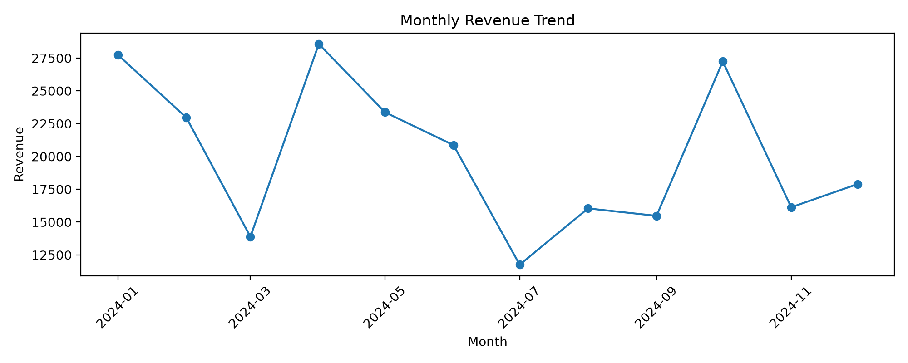
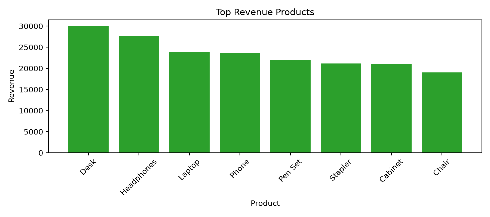
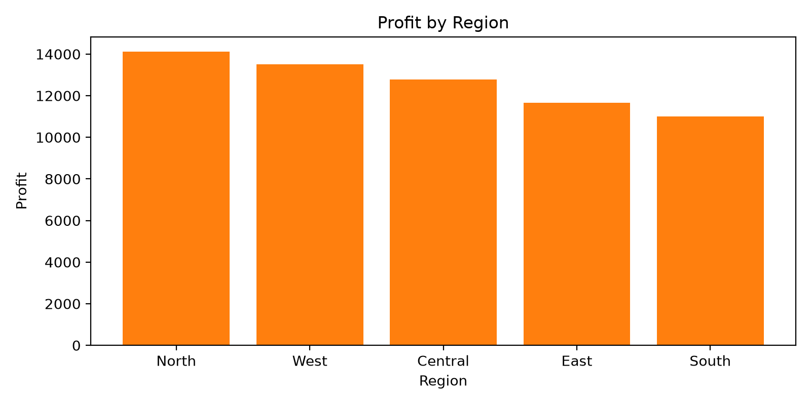
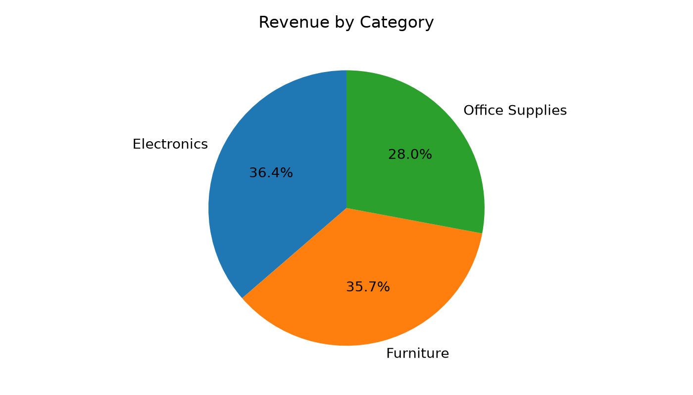

# Business Sales Performance Report

## Executive Summary
This sales analytics project highlights the strongest revenue drivers, profitable regions, and the most promising growth opportunities for a business team. The analysis uses a realistic sample sales dataset and is designed to be client-ready for internal presentations or portfolio submissions.

## Key Metrics
- Total Revenue: $241887.14
- Total Profit: $63066.31
- Average Order Value: $1007.86
- Best Month: 2024-04
- Monthly Revenue Growth: 5.0%

## Key Insights
- The highest revenue product is **Desk**.
- The most profitable region is **North**.
- The strongest revenue category is **Electronics**.
- Revenue growth is trending positively, suggesting that the business should focus on scaling the top-performing products and regions.

## Recommendations
1. Increase stock and marketing attention for **Desk** because it is the biggest revenue driver.
2. Expand sales efforts in **North** by increasing promotions, partnerships, and customer outreach.
3. Prioritize the **Electronics** category for cross-sell and upsell campaigns.
4. Review pricing and campaign timing to maintain momentum during weaker months.

## Visuals

